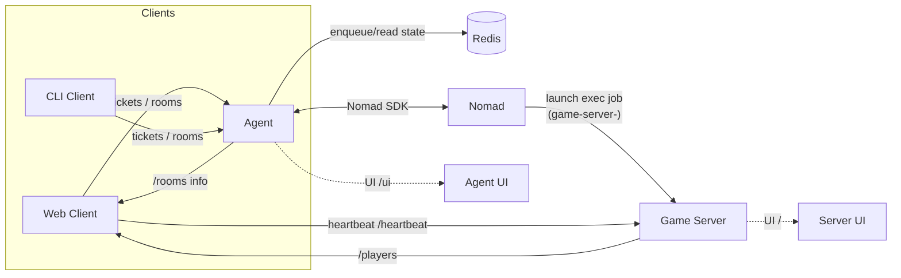
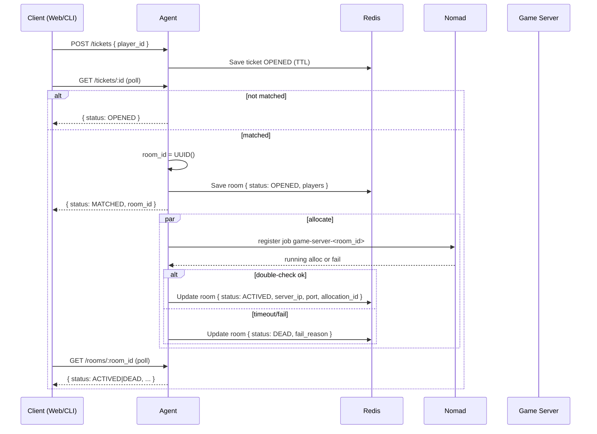
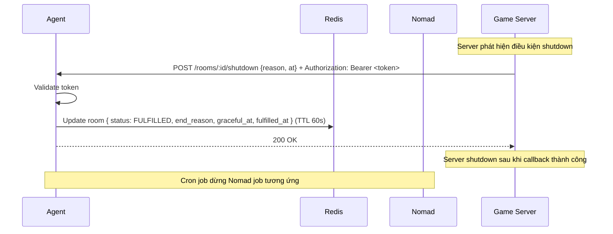
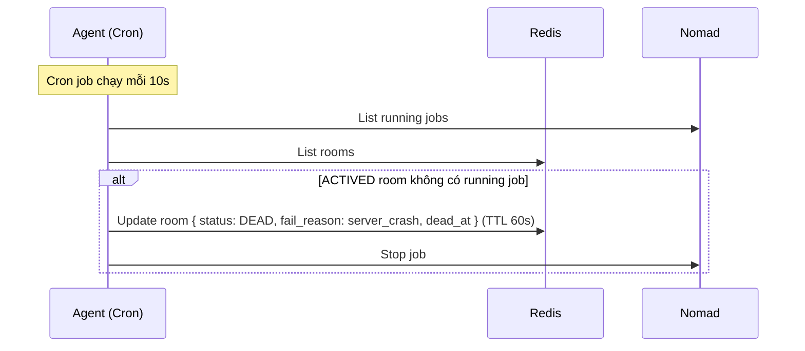

<golden_rules>
- Ngôn ngữ: Luôn trả lời bằng tiếng Việt.
- Phong cách: Code ngắn gọn, chạy được (MVP), ưu tiên rõ ràng.
- Hạn chế: Không tự tạo file test/MD, không tự chạy test khi chưa hỏi.
- Quy trình: Phải hỏi trước khi test hoặc chạy lệnh tốn tài nguyên.
- Chuẩn code: Tên biến rõ nghĩa, tránh viết tắt, early return.
- Output: Chỉ báo cáo ý chính, tránh dài dòng.
- Khi cập nhật thay đổi các dto (request, response struct), phải xem lại tất cả các document, hoặc toàn bộ các reference từ các package khác hoặc những dependency code để tiến hành cập nhật tương ứng
- các package store, mm và svrmng cần phải độc lập (portable) hạn chế hardcode giá trị vì có khá nhiều cmd khác nhau lệ thuộc vào. tránh trường hợp mở rộng tính năng cho 1 cmd/ nào đó nhưng sẽ lại ảnh hưởng logic của một cmd khác. VD thay đổi manager để update cho agentv2 phải đảm bảo không bị ảnh hưởng đến agentv2, do cả hai đều phụ thuộc vào pkg/svrmng
</golden_rules>

# Kiến trúc tổng thể

Hệ thống quản lý dedicated server phục vụ game theo mô hình: Agent (điều phối) + Nomad (orchestrator) + Game Server (exec) + Client (CLI/Web).

## Thành phần
- Agent (Go + Gin):
  - Cung cấp API: `POST /tickets`, `GET /tickets/:id`, `POST /tickets/:id/cancel`, `GET /rooms/:room_id`, `GET /admin/overview`. Không còn `create_room`/`join_room` legacy trong flow mới.
  - Kết nối Nomad qua SDK (`github.com/hashicorp/nomad/api`) để đăng ký job `game-server-<room_id>` (driver exec), cấp port động, truyền `room_id` làm đối số thứ 2 cho server.
  - Lưu trạng thái phòng vào Redis (`github.com/redis/go-redis/v9`): danh sách người chơi, room_id, allocation_id, server_ip, port, trạng thái `OPENED|ACTIVED|DEAD|FULFILLED`.
  - Chạy cron đồng bộ: đảm bảo `count(RUNNING game-server jobs) == count(ACTIVED rooms)`. Dừng job nếu room `DEAD`/`FULFILLED`. Mark `ACTIVED` room không có job → `DEAD(server_crash)`. Mark `OPENED` timeout → `DEAD(alloc_timeout)`. Terminal rooms có TTL 60s.
  - Web UI `/ui`: bảng Tickets/Opened/Actived/Fulfilled/Dead, auto-refresh 3s.

- Game Server (Go + Gin):
  - Nhận port (arg1), `room_id` (arg2), và `bearer_token` (arg3) từ Nomad, lắng nghe trên host port động.
  - Endpoint `GET /heartbeat?player_id=...`: ghi nhận heartbeat, CORS đã bật để browser đọc được response.
  - Endpoint `GET /players`: trả danh sách người chơi cùng trạng thái connected/disconnected.
  - Graceful shutdown: gửi `POST /rooms/:room_id/shutdown` đến Agent với `Authorization: Bearer <token>` khi no clients, client disconnect, hoặc nhận signal.
  - UI `/`: hiển thị room, số client connected, bảng players, log. Tự động tắt nếu có client disconnected >10s; bắt đầu kiểm tra sau 20s.

- Client:
  - CLI (Go) và Web (Go render HTML + JS). Web client cho phép nhập `player_id`, tạo/join room, poll server info, gửi heartbeat định kỳ 3s.

- Nomad:
  - Orchestrate job `game-server-<room_id>` (type=batch/hoặc service), driver `exec`, dynamic port label `http`.

- Redis:
  - Hàng đợi vé chờ (pending), set chống trùng `pending_players`, chỉ mục rooms, và trạng thái room.

## Tech stack
- Ngôn ngữ: Go 1.21+
- Web framework: Gin
- Orchestration: HashiCorp Nomad
- Cache/State: Redis
- Build/Deploy: Makefile + shell scripts (scp/ssh)
- UI: HTML+JS render từ Go, CSS thuần

## Sơ đồ kiến trúc

## Sơ đồ tuần tự

### Tickets & Matchmaking (mới)

### Graceful Shutdown Flow

### Server Crash Detection
