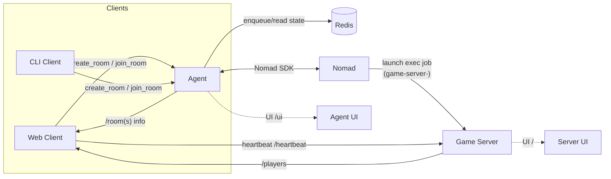
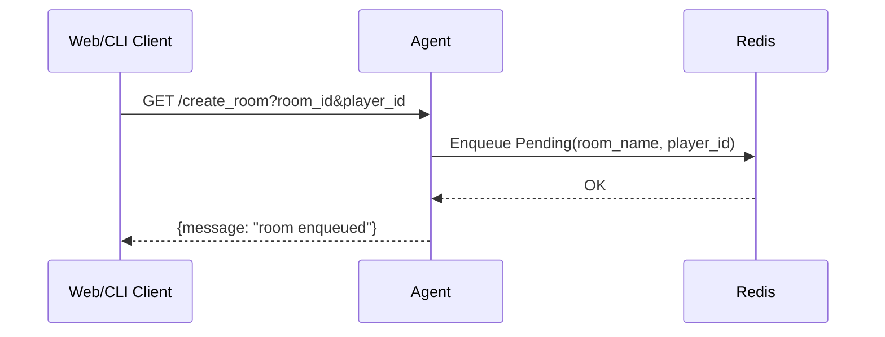
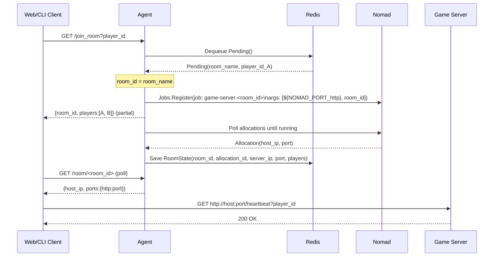

# Kiến trúc tổng thể

Hệ thống quản lý dedicated server phục vụ game theo mô hình: Agent (điều phối) + Nomad (orchestrator) + Game Server (exec) + Client (CLI/Web).

## Thành phần
- Agent (Go + Gin):
  - Cung cấp API: tạo vé create_room (xếp hàng), join_room (match & launch job), liệt kê rooms, xem room info.
  - Kết nối Nomad qua SDK (`github.com/hashicorp/nomad/api`) để đăng ký job `game-server-<room_id>` (driver exec), cấp port động, truyền `room_id` làm đối số thứ 2 cho server.
  - Lưu trạng thái phòng vào Redis (`github.com/redis/go-redis/v9`): danh sách người chơi, room_id, allocation_id, server_ip, port.
  - Chạy cron đồng bộ: xóa room “zombie” trong Redis nếu không còn job/alloc, dừng các job `game-server-*` lạc loài.
  - Web UI `/ui`: bảng Waiting/Matched, auto-refresh 3s.

- Game Server (Go + Gin):
  - Nhận port (arg1) và `room_id` (arg2) từ Nomad, lắng nghe trên host port động.
  - Endpoint `GET /heartbeat?player_id=...`: ghi nhận heartbeat, CORS đã bật để browser đọc được response.
  - Endpoint `GET /players`: trả danh sách người chơi cùng trạng thái connected/disconnected.
  - UI `/`: hiển thị room, số client connected, bảng players, log. Tự động tắt nếu có client disconnected >10s; bắt đầu kiểm tra sau 10s.

- Client:
  - CLI (Go) và Web (Go render HTML + JS). Web client cho phép nhập `player_id`, tạo/join room, poll server info, gửi heartbeat định kỳ 3s.

- Nomad:
  - Orchestrate job `game-server-<room_id>` (type=batch/hoặc service), driver `exec`, dynamic port label `http`.

- Redis:
  - Hàng đợi vé chờ (pending), set chống trùng `pending_players`, chỉ mục rooms, và trạng thái room.

## Tech stack
- Ngôn ngữ: Go 1.21+
- Web framework: Gin
- Orchestration: HashiCorp Nomad
- Cache/State: Redis
- Build/Deploy: Makefile + shell scripts (scp/ssh)
- UI: HTML+JS render từ Go, CSS thuần

## Sơ đồ kiến trúc

## Sơ đồ tuần tự

### create_room (enqueue only)

### join_room (match + launch job)
