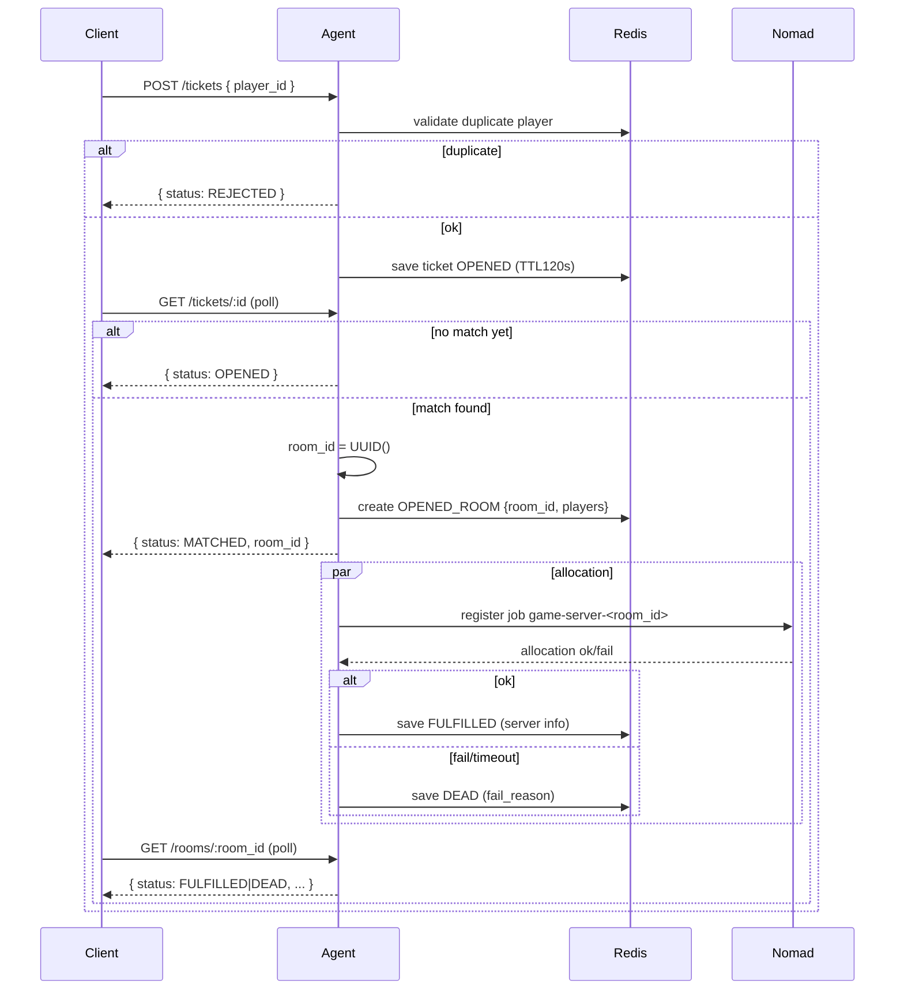

# Matchmaking Design (Draft)

Tài liệu này mô tả chi tiết thiết kế Matchmaking (MM) với thời hạn (TTL) cho ticket và các pha/ trạng thái của ticket/room, chỉ là kế hoạch (không implement ngay) để rà soát tính nhất quán.

## Mục tiêu (cập nhật)
- Ticket chỉ còn một loại: join (không nhập `room_id`/`room_name`).
- Agent tự quản lý phòng: khi tìm thấy match, Agent sinh `room_id` (UUID) và gán cho cặp ticket; nhờ đó Agent kiểm soát được duplicate room 100%.
- Ticket có TTL 120s (EXPIRED), có thể REJECTED (duplicate player ticket), MATCHED khi ghép; room có trạng thái OPENED → (FULFILLED | DEAD).
- Consistency: số `FULFILLED_ROOMS` phải bằng số Nomad jobs RUNNING `game-server-*`; khi server dừng, chỉ xóa room khỏi Redis (không dừng job để giữ log).

## Trạng thái & Danh sách
- Ticket status: `OPENED`, `MATCHED`, `EXPIRED`, `REJECTED`.
- Room status: `OPENED`, `FULFILLED`, `DEAD`.
- Danh sách quản lý (Redis):
  1. `OPENED_TICKETS`: tập vé chờ (chưa match), TTL 120s mỗi vé.
  2. `OPENED_ROOMS`: phòng vừa lập khi match (2 ticket), `status=OPENED`.
  3. `FULFILLED_ROOMS`: phòng đã alloc server (ip/port/allocation_id), `status=FULFILLED`.
  4. `DEAD_ROOMS`: phòng alloc thất bại (fail_reason), `status=DEAD`.

## Quy trình (Pha)
1) Submit ticket (join)
- Client gửi ticket: `{player_id}` (không kèm `room_id`/`room_name`).
- Validate: nếu `player_id` đã có ticket OPENED → `REJECTED`.
- Lưu ticket vào `OPENED_TICKETS` (TTL 120s), `status=OPENED`.

2) Polling Ticket
- Client poll ticket status: nếu chưa ghép → `OPENED`.
- Nếu quá TTL → `EXPIRED`, dọn sạch mọi key/index liên quan.

3) Match found → Room OPENED
- Logic đơn giản: 2 ticket tạo 1 match.
- Agent sinh `room_id = UUID()`, tạo `OPENED_ROOMS:{room_id}` với 2 players.
- Cập nhật cả hai ticket `status=MATCHED` với `room_id` (trả về cho client). Bắt đầu alloc server async.

4) Allocation → FULFILLED / DEAD
- Thành công: ghi vào `FULFILLED_ROOMS:{room_id}` (server ip/port, allocation_id), room chuyển FULFILLED.
- Thất bại/timeout: ghi vào `DEAD_ROOMS:{room_id}` với `fail_reason=alloc_timeout|nomad_error`, room chuyển DEAD.
- Client sau khi `MATCHED` sẽ poll `/rooms/:room_id` đến khi FULFILLED (nhận server) hoặc DEAD (dừng).

5) Consistency & Cleanup (một chiều về client)
- Chỉ so sánh `FULFILLED_ROOMS` với danh sách Nomad jobs RUNNING prefix `game-server-*`.
- Nếu server dừng (crash/finish/disconnect) hoặc job không RUNNING nữa: chỉ xóa `room_id` khỏi `FULFILLED_ROOMS` (không xóa/dừng job để giữ log).
- Nếu `FULFILLED_ROOMS` có `room_id` nhưng lookup RUNNING job không thấy: chỉ xóa khỏi `FULFILLED_ROOMS`.
- Mục tiêu: `count(FULFILLED_ROOMS) == count(RUNNING jobs game-server-*)`.

## TTL & Timeout
- Ticket TTL 120s: Redis EXPIRE trực tiếp trên key ticket; khi hết hạn → EXPIRED và purge index.
- Allocation timeout `alloc_timeout_seconds` (đề xuất 300–600s): nếu room OPENED quá ngưỡng mà chưa FULFILLED → chuyển DEAD với `fail_reason=alloc_timeout`.

## Dữ liệu & Redis Schema (đề xuất)
- Ticket
  - `mm:ticket:<id>` → `{ticket_id, player_id, status, enqueue_at}` (EXPIRE 120s)
  - `mm:tickets:opened` (LIST/ZSET FIFO), `mm:players:pending` (SET chống trùng player)
- Room
  - `mm:room:opened:<room_id>` → `{room_id, players:[A,B], created_at, status:OPENED}`
  - `mm:room:fulfilled:<room_id>` → `{room_id, players, server:{ip,port,allocation_id}, created_at, status:FULFILLED}`
  - `mm:room:dead:<room_id>` → `{room_id, players, fail_reason, created_at, status:DEAD}`
  - Index: `mm:rooms:opened`, `mm:rooms:fulfilled`, `mm:rooms:dead`

## API đề xuất (đồng bộ với Agent/Web)
- `POST /tickets` body: `{ player_id }` → `{ ticket_id, status:OPENED|REJECTED }`
- `GET /tickets/:ticket_id` → `{ status: OPENED|MATCHED|EXPIRED|REJECTED, room_id? }`
- `POST /tickets/:ticket_id/cancel` → `{ status: CANCELED }` (chỉ khi ticket OPENED)
- `GET /rooms/:room_id` → `{ status: OPENED|FULFILLED|DEAD, server?, fail_reason?, players }`

## Sơ đồ tuần tự (cập nhật)
### Submit & Match

## Notes
- Bỏ hoàn toàn `create_room`/`room_name` từ client; Agent kiểm soát room_id bằng UUID, loại trừ vấn đề trùng `room_id` do người dùng nhập.
- Vẫn giữ Cancel Ticket (Priority 1) cho ticket OPENED.
- Chưa implement — tài liệu là nguồn tham chiếu để triển khai sau khi đồng thuận.
