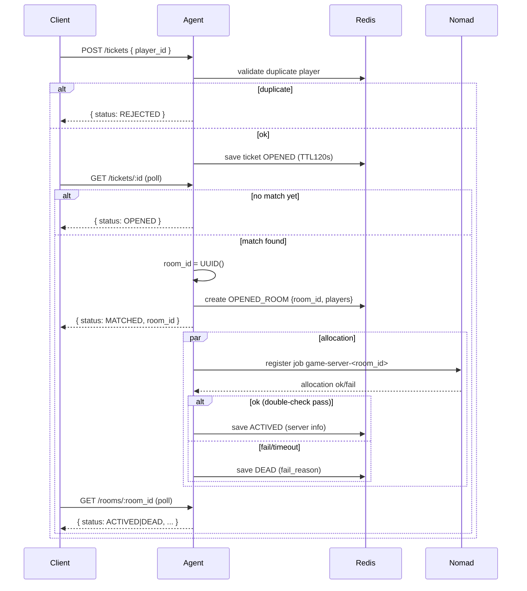

# Matchmaking Design (Draft)

Tài liệu này mô tả chi tiết thiết kế Matchmaking (MM) với thời hạn (TTL) cho ticket và các pha/ trạng thái của ticket/room, chỉ là kế hoạch (không implement ngay) để rà soát tính nhất quán.

## Mục tiêu (cập nhật)
- Ticket chỉ còn một loại: join (không nhập `room_id`/`room_name`).
- Agent tự quản lý phòng: khi tìm thấy match, Agent sinh `room_id` (UUID) và gán cho cặp ticket; nhờ đó Agent kiểm soát được duplicate room 100%.
- Ticket có TTL 120s (EXPIRED), có thể REJECTED (duplicate player ticket), MATCHED khi ghép; room có trạng thái OPENED → (ACTIVED | DEAD) → FULFILLED.
- Consistency: số `ACTIVED_ROOMS` phải xấp xỉ số Nomad jobs RUNNING `game-server-*`; khi server graceful shutdown/hoàn thành game cycle → chuyển `FULFILLED` (terminal, TTL ngắn) để client có thể quan sát hậu trạng thái.

## Trạng thái & Danh sách
- Ticket status: `OPENED`, `MATCHED`, `EXPIRED`, `REJECTED`.
- Room status: `OPENED`, `ACTIVED`, `DEAD`, `FULFILLED`.
- Danh sách quản lý (Redis):
  1. `OPENED_TICKETS`: tập vé chờ (chưa match), TTL 120s mỗi vé.
  2. `OPENED_ROOMS`: phòng vừa lập khi match (2 ticket), `status=OPENED`.
  3. `ACTIVED_ROOMS`: phòng đã allocate thành công (double-check pass) và sẵn sàng nhận kết nối client, `status=ACTIVED`.
  4. `DEAD_ROOMS`: phòng allocate thất bại (fail_reason), `status=DEAD` (terminal, TTL ngắn).
  5. `FULFILLED_ROOMS`: phòng đã graceful shutdown/hoàn thành game cycle, `status=FULFILLED` (terminal, TTL ngắn).

## Quy trình (Pha)
1) Submit ticket (join)
- Client gửi ticket: `{player_id}` (không kèm `room_id`/`room_name`).
- Validate: nếu `player_id` đã có ticket OPENED → `REJECTED`.
- Lưu ticket vào `OPENED_TICKETS` (TTL 120s), `status=OPENED`.

2) Polling Ticket
- Client poll ticket status: nếu chưa ghép → `OPENED`.
- Nếu quá TTL → `EXPIRED`, dọn sạch mọi key/index liên quan.

3) Match found → Room OPENED
- Logic đơn giản: 2 ticket tạo 1 match.
- Agent sinh `room_id = UUID()`, tạo `OPENED_ROOMS:{room_id}` với 2 players.
- Cập nhật cả hai ticket `status=MATCHED` với `room_id` (trả về cho client). Bắt đầu alloc server async.

4) Allocation → ACTIVED / DEAD (double-check)
- Thành công (double-check): ghi vào `ACTIVED_ROOMS:{room_id}` (server ip/port, allocation_id), room chuyển ACTIVED.
- Thất bại/timeout: ghi vào `DEAD_ROOMS:{room_id}` với `fail_reason=alloc_timeout|nomad_error`, room chuyển DEAD.
- Client sau khi `MATCHED` sẽ poll `/rooms/:room_id` đến khi ACTIVED (nhận server) hoặc DEAD (dừng).

5) Lifecycle sau allocate → FULFILLED
- Khi server graceful shutdown hoặc hoàn tất 1 game cycle: room chuyển `FULFILLED` và được giữ ở Redis với TTL ngắn để client/ops có thể quan sát hậu trạng thái.

6) Consistency & Cleanup (một chiều về client)
- So sánh `ACTIVED_ROOMS` với danh sách Nomad jobs RUNNING prefix `game-server-*`.
- Nếu job không RUNNING nhưng room còn `ACTIVED`: tùy tín hiệu từ server/agent, chuyển `FULFILLED` (graceful/end-cycle) hoặc `DEAD` (fail) rồi áp TTL.
- `FULFILLED` và `DEAD` là terminal và chỉ duy trì tạm thời (TTL), không tham gia consistency với RUNNING jobs.

## TTL & Timeout
- Ticket TTL 120s: Redis EXPIRE trực tiếp trên key ticket; khi hết hạn → EXPIRED và purge index.
- Allocation timeout `allocate_ttl_seconds` (mặc định 90s, cấu hình được): nếu room OPENED quá ngưỡng mà chưa ACTIVED → chuyển DEAD với `fail_reason=alloc_timeout`.
- Terminal TTL: `DEAD` và `FULFILLED` lưu ở Redis với TTL ngắn (mặc định 60s, cấu hình được) để client poll nhận `DEAD`/`FULFILLED` thay vì `ROOM_NOT_FOUND`, hỗ trợ debug/inspect.
- Double-check interval: 2–5s (cấu hình) giữa 2 lần kiểm tra sẵn sàng.

## Dữ liệu & Redis Schema (đề xuất)
- Ticket
  - `mm:ticket:<id>` → `{ticket_id, player_id, status, enqueue_at}` (EXPIRE 120s)
  - `mm:tickets:opened` (LIST/ZSET FIFO), `mm:players:pending` (SET chống trùng player)
- Room
  - `mm:room:opened:<room_id>` → `{room_id, players:[A,B], created_at, status:OPENED}` (EXPIRE allocate_ttl_seconds)
  - `mm:room:actived:<room_id>` → `{room_id, players, server:{ip,port,allocation_id}, created_at, activated_at, status:ACTIVED}`
  - `mm:room:dead:<room_id>` → `{room_id, players, fail_reason, created_at, dead_at, status:DEAD}` (EXPIRE dead_fulfilled_ttl)
  - `mm:room:fulfilled:<room_id>` → `{room_id, players, result?, created_at, fulfilled_at, status:FULFILLED}` (EXPIRE dead_fulfilled_ttl)
  - Index: `mm:rooms:opened`, `mm:rooms:actived`, `mm:rooms:dead`, `mm:rooms:fulfilled`
  - Metadata khuyến nghị: `version` (CAS), `state_rank`, `attempt_count`, `nomad_job_id`, `alloc_id`, `node`

## API đề xuất (đồng bộ với Agent/Web)
- `POST /tickets` body: `{ player_id }` → `{ ticket_id, status:OPENED|REJECTED }`
- `GET /tickets/:ticket_id` → `{ status: OPENED|MATCHED|EXPIRED|REJECTED, room_id? }`
- `POST /tickets/:ticket_id/cancel` → `{ status: CANCELED }` (chỉ khi ticket OPENED)
- `GET /rooms/:room_id` → `{ status: OPENED|ACTIVED|DEAD|FULFILLED, server?, fail_reason?, players }` (luôn 200; không trả 404 trong TTL terminal)

## Sơ đồ tuần tự (cập nhật)
### Submit & Match

## Notes
- Bỏ hoàn toàn `create_room`/`room_name` từ client; Agent kiểm soát room_id bằng UUID, loại trừ vấn đề trùng `room_id` do người dùng nhập.
- Double-check allocate: (1) Nomad alloc RUNNING/healthy, (2) readiness probe của room service sau một khoảng ngắn.
- `DEAD` và `FULFILLED` lưu với TTL ngắn để client nhận trạng thái cuối thay vì `ROOM_NOT_FOUND` và hỗ trợ debug.
- Idempotency & Locking: ràng buộc 1 job/room, dùng lock phân tán khi allocate; cập nhật state qua CAS/version + `state_rank`.
- Vẫn giữ Cancel Ticket (Priority 1) cho ticket OPENED.
- Chưa implement — tài liệu là nguồn tham chiếu để triển khai sau khi đồng thuận.
